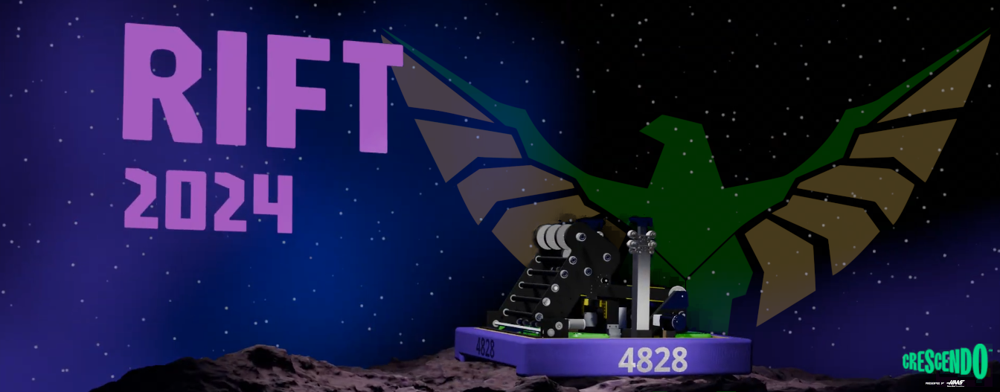

# Requirements
- Ubuntu 22.04
- [Visual Studio Code](https://code.visualstudio.com/)
- RTX Enabled NVIDIA GPU
- (Optional) An Xbox controller

# Installation

### 1. Install Graphics Drivers
Simply run `sudo apt-get install nvidia-driver-525` in order to install the NVIDIA graphics driver for Ubuntu!

### 2. Local Setup
- **Install Docker and Nvidia Docker**  
Running `./scripts/local-setup.sh` should install the requirements for this repository to run! At some point during running, it may prompt you for a `ROS_NAMESPACE`, which you can read more about [here](https://docs.ros.org/en/foxy/Tutorials/Intermediate/Launch/Using-ROS2-Launch-For-Large-Projects.html#namespaces). Make sure to restart your machine once the script is done running!

- **Install Remote Development VS Code Extension**  
This repository requires the [Remote Development](https://marketplace.visualstudio.com/items?itemName=ms-vscode-remote.vscode-remote-extensionpack) extension pack. Make sure to install it in the VSCode extensions window!

- **Reopen in Devcontainer**  
Once installed, you can open the command pallate by pressing <kbd>F1</kbd>, and running the command `Reopen in Container` in order to open the devcontainer. This might take a while, but once it's finished you should see a message appear in a console stating some helpful commands, along with a list of connected controllers and your `ROS_NAMESPACE` which you set up earlier.

### 3. (Optional) ROS Setup
For parts of the robot to communicate, both in the simulation and in the real world, we use ROS2 in order to communicate between all of the parts of our project!
- **Building the project**  
The entire project is built as a colcon task, so you can run it by pressing <kbd>Ctrl</kbd>+<kbd>Shift</kbd>+<kbd>B</kbd> in VSCode, or by running `colcon build --symlink-install` in order to build all of the ROS2 packages.

To confirm that this worked, you can simply open a new terminal, and the warning message reminding you to build should be gone!

# Setting up the Robot
Because of how our repository is built on the [RobotPy](https://robotpy.readthedocs.io/) framework, you're going to need to install RobotPy.

### 1. Installing RobotPy
If you followed the devcontainer setup, then all required packages should've already been installed by the build script. You might want to double check 

### 2. Deploying to the RoboRIO  
To deploy to the RoboRIO, you'll need to connect your computer to the RIO, either over USB or over the network. Once you're connected you can run `robotpy deploy` in order to flash the script onto the RoboRIO.

# Running the Robot
(In real life)
1. Connect an xbox controller
2. Launch FRC Driverstation
3. Launch WPILib Shuffleboard
4. Select auton/teleop
5. Press Enable
